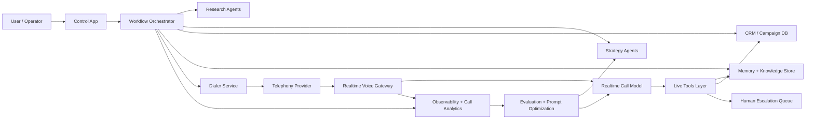
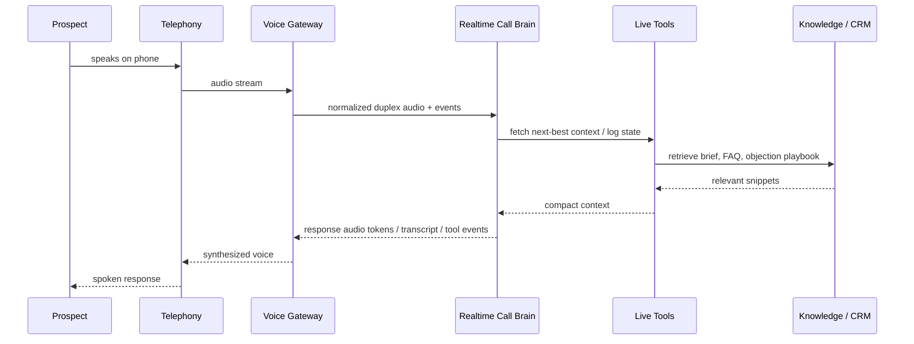

# Autonomous LLM Sales Calling System Architecture

## 1. Goal

Build an outbound sales platform that starts from a user-provided product, offer, ICP, and optional prospect list, then autonomously:

1. Researches prospects and companies
2. Builds personalized call strategy
3. Executes real-time voice calls
4. Adapts mid-call based on live signals
5. Updates CRM, schedules follow-ups, and improves over time

This document recommends a production architecture optimized for:

- high outbound throughput
- low live-call latency
- strong personalization
- measurable improvement loops
- modular agent orchestration instead of one giant prompt

## 2. Core Design Decision

Do not build this as "many agents talking live on the phone."

That sounds powerful but usually fails in production because:

- latency becomes unacceptable
- decision paths become nondeterministic
- voice quality degrades
- debugging becomes impossible
- cost explodes

The correct design is:

- `Async planning swarm` before the call
- `Single realtime call brain` during the call
- `Async analysis swarm` after the call and between turns when needed

In other words:

- many agents can think
- only one agent should speak

## 3. Product Modes

### 3.1 Campaign Mode

The user provides:

- product or service to sell
- target ICP
- geography / industry / company size
- campaign constraints
- optional lead source

The system then:

- discovers and enriches prospects
- prioritizes leads
- creates tailored call plans
- launches autonomous calling sequences
- handles outcomes and follow-ups

Use this for scale.

### 3.2 Direct Mode

The user provides:

- a specific phone number
- company or contact info if known
- product or offer
- optional notes or goals

The system then:

- researches the company deeply
- infers role, pains, likely objections, and context
- creates a custom call brief
- generates talk tracks and objection frames
- executes the call with a highly personalized strategy

Use this for high-value accounts.

## 4. Recommended System Shape

### 4.1 Topology



### 4.2 Recommended Technology Direction

Use a split stack:

- `Planning and orchestration`
  - workflow engine and state machine
  - reasoning model for research, strategy, and summarization
- `Live voice path`
  - telephony provider for PSTN
  - realtime speech model for low-latency bidirectional audio
- `Data and memory`
  - relational DB for system-of-record state
  - document store / blob store for research and transcripts
  - vector index for retrieval over call history, product knowledge, and sales plays

Recommended initial stack:

- `Frontend / operator console`: Next.js or similar
- `API / orchestration`: TypeScript services
- `Workflow engine`: Temporal or durable job/state orchestration
- `Telephony`: Sonetel for outbound and future inbound, wrapped by a telephony adapter
- `Live voice`: Azure OpenAI GPT Realtime deployment through a dedicated voice gateway
- `Async reasoning`: Azure OpenAI model deployments for research, strategy, summarization, and evaluation workers
- `DB`: Postgres
- `Queue / event bus`: Redis streams, Kafka, or cloud queue
- `Search / retrieval`: vector + keyword hybrid index
- `Observability`: structured traces, audio QA metrics, prompt/version tracking

### 4.3 Provider Boundary

Treat telephony as a provider boundary from day one.

The system should expose an internal `telephony-adapter` contract and keep Sonetel-specific behavior inside that adapter. This matters because the live voice system depends on low-latency audio transport, call events, and stable session control.

Internal adapter responsibilities:

- outbound call initiation
- inbound call event normalization
- call status webhooks
- media/session bridge into `voice-gateway`
- recording and metadata normalization

This keeps the rest of the stack independent from Sonetel-specific APIs.

## 5. Agent Architecture

Use a bounded multi-agent system with explicit contracts.

### 5.1 Agent Roles

#### 1. Campaign Planner Agent

Input:

- product
- offer
- ICP
- campaign objective

Output:

- campaign brief
- target hypotheses
- messaging pillars
- success criteria

#### 2. Prospect Discovery Agent

Input:

- ICP and filters

Output:

- candidate companies
- candidate contacts
- confidence scores

#### 3. Company Research Agent

Input:

- company domain / name / metadata

Output:

- company profile
- business model
- pains and likely initiatives
- recent signals
- sales hooks

#### 4. Persona Inference Agent

Input:

- contact title
- company profile
- industry context

Output:

- probable priorities
- probable objections
- buying triggers
- recommended framing

#### 5. Offer Match Agent

Input:

- product knowledge
- company research
- persona inference

Output:

- strongest value prop
- proof points
- case-study angles
- expected ROI narrative

#### 6. Call Strategy Agent

Input:

- research package
- offer match
- campaign goal

Output:

- opening line variants
- qualification path
- objection handling tree
- risk flags
- CTA strategy
- fallback branches

#### 7. Compliance / Policy Agent

Input:

- call plan
- target metadata
- campaign policy

Output:

- allowed / blocked / review
- required disclosures
- restricted behaviors

This should be a deterministic policy gate where possible, not only an LLM opinion.

#### 8. Realtime Call Brain

Input:

- live transcript
- live call state
- prepared strategy packet
- tool access

Output:

- next utterance
- tool calls
- state updates
- disposition proposals

This is the only speaking agent.

#### 9. Realtime Sales Coach

Input:

- live transcript stream
- sentiment / interruptions / hesitation signals

Output:

- silent internal suggestions to the call brain
- next-best-action hints

This agent never talks directly. It only writes private coaching context.

#### 10. Post-Call Analyst

Input:

- transcript
- audio features
- outcome

Output:

- structured call summary
- objections encountered
- win / loss reason
- follow-up draft
- improvement recommendations

#### 11. Sequence Agent

Input:

- call outcome
- CRM state

Output:

- next touch recommendation
- email / SMS / callback task
- requeue or stop decision

## 6. Orchestration Pattern

Use hierarchical orchestration, not free-agent autonomy.

### 6.1 Master Control Plane

A top-level orchestrator owns:

- workflow state
- retries
- deadlines
- agent permissions
- human escalation
- audit trail

### 6.2 State Machine

Each lead should move through an explicit state machine:

```text
LEAD_CREATED
-> RESEARCHING
-> STRATEGY_READY
-> POLICY_CHECKED
-> READY_TO_CALL
-> DIALING
-> IN_CALL
-> CALL_COMPLETED
-> FOLLOWUP_GENERATED
-> SEQUENCE_SCHEDULED
-> WON / LOST / NURTURE / BLOCKED
```

### 6.3 Event-Driven Model

Emit events for every major change:

- `lead.researched`
- `strategy.generated`
- `call.started`
- `call.turn.completed`
- `call.objection.detected`
- `call.ended`
- `followup.created`
- `deal.updated`

This gives replayability and analytics.

## 7. Real-Time Voice Architecture

This is the most important boundary in the whole system.

### 7.1 Rule

The live audio loop must stay thin.

The live path should only do:

- audio transport
- streaming transcription / understanding
- immediate response generation
- low-latency tool calls
- barge-in handling
- interruption-safe speaking

Do not do heavyweight research during the call unless you can tolerate delay.

### 7.2 Live Call Stack



### 7.3 Voice Gateway Responsibilities

Create a dedicated `voice-gateway` service between telephony and the realtime model. It should own:

- media stream session setup
- call session authentication
- audio normalization
- partial transcript buffering
- interruption detection
- speech start / stop markers
- conversation state cache
- safe tool invocation wrappers
- latency measurement
- failover behavior

Do not let the telephony provider talk directly to every internal subsystem.

### 7.4 Call-Time Context Budget

The realtime model should receive a compact strategy packet, not a raw research dump.

Provide:

- one-page company summary
- one-page persona summary
- top 3 pains
- top 3 proof points
- opening strategy
- objection tree
- CTA options
- forbidden claims
- current call state

Keep rich source material outside the model context window and fetch small snippets on demand.

## 8. Knowledge and Memory Design

Use four memory classes.

### 8.1 Product Memory

Contains:

- product docs
- pricing
- case studies
- proof points
- competitor positioning
- FAQ

### 8.2 Prospect Memory

Contains:

- company profile
- contact details
- prior calls
- prior emails
- objections seen before
- account notes

### 8.3 Strategy Memory

Contains:

- generated call briefs
- winning talk tracks
- campaign message variants
- objection handling patterns

### 8.4 Learning Memory

Contains:

- evaluation results
- failed calls
- successful transcripts
- prompt version outcomes
- industry-specific best practices learned over time

## 9. Data Model

At minimum define these entities.

### 9.1 Core Tables

- `users`
- `workspaces`
- `products`
- `campaigns`
- `prospects`
- `companies`
- `contacts`
- `call_briefs`
- `call_sessions`
- `call_turns`
- `transcripts`
- `dispositions`
- `followups`
- `experiments`
- `prompt_versions`
- `policy_flags`

### 9.2 Suggested Object Shapes

#### `call_brief`

```json
{
  "prospectId": "uuid",
  "campaignId": "uuid",
  "summary": "short company + persona context",
  "valueProps": ["..."],
  "painPoints": ["..."],
  "proofPoints": ["..."],
  "openingLines": ["..."],
  "objectionTree": [
    {
      "objection": "not interested",
      "intent": "brush-off",
      "recommendedResponse": "...",
      "followupQuestion": "..."
    }
  ],
  "ctaOptions": ["book_demo", "send_info", "callback"],
  "riskFlags": ["..."],
  "version": "v1"
}
```

#### `call_session`

```json
{
  "id": "uuid",
  "prospectId": "uuid",
  "status": "in_call",
  "telephonyProvider": "sonetel",
  "voiceSessionId": "string",
  "strategyVersion": "v1",
  "startedAt": "timestamp",
  "endedAt": null,
  "outcome": null,
  "latencyMsP95": 720
}
```

## 10. End-to-End Workflow

### 10.1 Campaign Mode

1. User enters product, offer, ICP, and campaign goal
2. Campaign Planner creates campaign brief
3. Prospect Discovery finds candidate accounts and contacts
4. Research agents build company and persona dossiers
5. Offer Match and Call Strategy produce `call_brief`
6. Policy gate approves, blocks, or queues review
7. Dialer schedules and launches calls
8. Realtime Call Brain runs the live call
9. Post-Call Analyst writes structured outcomes
10. Sequence Agent schedules next action
11. Evaluation jobs score the call and update learning memory

### 10.2 Direct Mode

1. User enters phone number, company, and product info
2. Identity resolution maps number to company/contact where possible
3. Research depth is increased for this lead
4. Strategy agent creates a high-personalization brief
5. Operator can optionally review before dial
6. Call executes through the same realtime path
7. Post-call follow-up and CRM sync run automatically

## 11. Prompting Architecture

Do not use one giant system prompt for everything.

Use layered prompt contracts.

### 11.1 Realtime Call Brain Prompt Layers

1. `Global behavior`
   - tone
   - allowed goals
   - forbidden behavior
   - turn-taking rules

2. `Sales methodology`
   - opening approach
   - qualification framework
   - objection handling principles
   - CTA selection rules

3. `Campaign strategy`
   - campaign-specific messaging
   - value props
   - approved claims

4. `Lead-specific brief`
   - company details
   - contact hypothesis
   - likely pains
   - custom hooks

5. `Live state`
   - current stage
   - what has already been said
   - objections encountered
   - promise commitments made

### 11.2 Prompt Engineering Rule

Teach the system to be a great salesperson through:

- retrieval of winning examples
- evaluation loops
- structured playbooks
- simulation against synthetic prospects
- selective fine-tuning only after enough labeled data exists

Do not start with model training.

Start with prompt + retrieval + evaluation.

## 12. Psychology and Persuasion Layer

You specifically asked for heavy psychology. The right way to do that is to encode persuasion as reusable strategy primitives, not manipulative free-form prompting.

Represent this as structured frames:

- rapport frame
- curiosity frame
- authority frame
- loss-avoidance frame
- ROI frame
- social-proof frame
- problem agitation frame
- low-friction CTA frame

Each frame should include:

- when to use
- when not to use
- risks
- example wording
- matching objections

The strategy agent chooses frames. The realtime model executes them.

## 13. Sales Methodology Layer

Use an explicit internal sales operating model, for example:

- `Open`
- `Pattern interrupt`
- `Reason for call`
- `Relevance hook`
- `Qualification`
- `Pain deepening`
- `Value alignment`
- `Objection handling`
- `Micro-commitment`
- `Meeting close`
- `Fallback close`

Every live turn should map to one of these stages.

That gives much better control than vague "be persuasive" prompting.

## 14. Tooling Available to the Realtime Call Brain

Keep the tool set small and safe.

Recommended tools:

- `get_call_brief`
- `lookup_product_fact`
- `lookup_case_study`
- `lookup_pricing_guardrails`
- `update_call_stage`
- `log_objection`
- `create_followup_task`
- `book_meeting`
- `escalate_to_human`
- `end_call_with_disposition`

Avoid giving the live model unrestricted search, raw web browsing, or broad database write access.

## 15. Latency Budget

Define hard budgets from day one.

Suggested live-call targets:

- telephony to voice gateway transport: `<150ms`
- gateway to model roundtrip: `<500ms median`
- end-of-user-utterance to first audio response: `<900ms median`
- tool call response for common lookups: `<300ms`

If a tool will exceed the budget:

- use cached data
- answer with a bridging phrase
- or defer to follow-up

## 16. Evaluation System

This is where the moat comes from.

### 16.1 Score Every Call

Track:

- pickup rate
- first 10-second retention
- objection rate
- meeting-booked rate
- average talk ratio
- interruption count
- compliance incidents
- hallucination incidents
- follow-up conversion

### 16.2 Score Every Turn

Track:

- stage correctness
- relevance
- empathy
- clarity
- objection handling quality
- CTA timing
- factuality
- policy adherence

### 16.3 Build an Improvement Flywheel

1. Calls generate transcripts and metrics
2. Evaluator models score quality
3. Failures are clustered by pattern
4. New prompt / playbook variants are generated
5. Offline simulations test changes
6. A/B tests deploy improved versions
7. Winning variants become the new default

## 17. Human-in-the-Loop Design

Full autonomy is useful, but selective human control improves revenue.

Support:

- approval before first call in direct mode
- whisper mode suggestions to human closers
- live takeover / transfer
- manager review for flagged calls
- manual override of generated strategy

Best setup:

- autonomous for top-of-funnel qualification
- human-assisted for late-stage or high-ACV closing

## 18. Safety and Failure Handling

Failures are guaranteed. Design them intentionally.

### 18.1 Failure Modes

- call brain loses context
- telephony stream drops
- prospect asks unsupported factual question
- booking tool fails
- model starts looping
- latency spikes
- prospect hostility

### 18.2 Required Fallbacks

- graceful apology and recovery lines
- deterministic maximum silence thresholds
- tool timeout fallbacks
- safe end-call behavior
- immediate human escalation option
- automatic transcript and replay capture

## 19. Security and Access Model

Use strict capability boundaries.

- operator app cannot directly write to live call state without API control
- live model cannot access arbitrary DB tables
- prompts and strategy versions are immutable and versioned
- all call decisions are traceable to a session, prompt version, and brief version

## 20. Deployment View

Separate services by latency sensitivity.

### 20.1 Control Plane Services

- `app-api`
- `orchestrator`
- `research-worker`
- `strategy-worker`
- `evaluation-worker`
- `crm-sync-worker`

### 20.2 Realtime Plane Services

- `dialer-service`
- `voice-gateway`
- `live-tool-service`
- `session-state-cache`

### 20.3 Data Plane

- `postgres`
- `blob/document storage`
- `vector index`
- `analytics warehouse`

## 21. Suggested Repository Structure

Since this repo is empty, start with this:

```text
docs/
  autonomous-sales-calling-architecture.md
  product-requirements.md
  prompt-contracts.md
  event-schema.md

services/
  app-api/
  orchestrator/
  research-worker/
  strategy-worker/
  voice-gateway/
  live-tool-service/
  evaluation-worker/

packages/
  domain-models/
  prompt-kits/
  sales-playbooks/
  shared-events/

infra/
  terraform-or-bicep/

data/
  seed-playbooks/
  evaluation-scenarios/
```

## 22. Recommended Build Order

Do not try to build the full autonomous swarm first.

### Phase 1

- operator UI
- product and campaign intake
- direct mode only
- research packet generation
- call brief generation
- live voice call brain
- transcript + summary + CRM logging

Success condition:

- one personalized call can run reliably end to end

### Phase 2

- campaign mode
- lead scoring
- bulk dialing workflows
- follow-up sequencing
- evaluation dashboards

Success condition:

- stable outbound campaigns with measurable meeting-booked rate

### Phase 3

- adaptive strategy selection
- stronger objection policy engine
- simulation harness
- prompt optimization loop
- human takeover and whisper tooling

Success condition:

- repeatable improvement cycle with versioned gains

### Phase 4

- multi-product memory
- account-level memory
- multilingual support
- vertical-specific playbooks
- optional fine-tuning from high-quality call data

## 23. Hard Recommendation

If you want the best real system, build this around three brains:

### Brain 1. Research Brain

Slow, deep, async, evidence-heavy.

### Brain 2. Strategy Brain

Structured, persuasive, produces compact call plans.

### Brain 3. Realtime Call Brain

Fast, conversational, tightly bounded, tool-assisted.

That is the correct architecture.

Not:

- one mega-agent
- fully autonomous live multi-agent chaos
- training-first
- unbounded tool access

## 24. First Concrete Deliverables

The first documents to add after this one should be:

1. `product-requirements.md`
2. `event-schema.md`
3. `prompt-contracts.md`
4. `call-state-machine.md`
5. `evaluation-rubric.md`

## 25. Final Architecture Summary

The winning design is a hierarchical, event-driven, multi-agent sales system where:

- async agents research and prepare
- one bounded realtime voice agent handles the live call
- post-call agents analyze and improve
- every call is scored
- every strategy is versioned
- the system learns through retrieval and evaluation before any fine-tuning

That gives you the highest chance of building something that is both aggressive in performance and sane to operate.

## 26. Implementation References

These are the platform capability areas this architecture assumes:

- Azure OpenAI realtime model deployment for the speaking agent
- Azure OpenAI model deployments for research, strategy, and evaluation workers
- Sonetel call control for outbound and future inbound telephony
- Sonetel-to-voice-gateway media/session bridge
- tool-calling support for the bounded realtime call brain

Implementation note:

- validate Sonetel media/session capabilities before building too deeply into the realtime plane
- keep a provider adapter between Sonetel and `voice-gateway`
